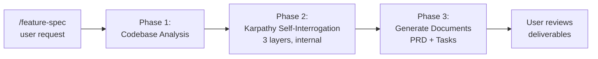
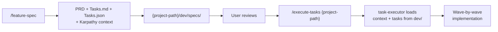

# Feature Spec

One trigger → full spec pipeline. Analyze codebase, brainstorm internally via Karpathy 3-layer method, produce PRD + tasks document with execution checklists.

## SYSTEM PROTOCOL: ARCHITECTURAL DECOMPOSITION ENGINE

When translating raw requirements into technical specifications, you must enforce a decoupled, event-driven architecture. Never define monolithic implementations. Every feature spec must be structured around three pillars:

### 1. MODULE ISOLATION (Where it lives)
- Identify the primary execution boundary for the feature.
- Assign the logic to a single, dedicated functional module directory.
- Enforce a strict "one responsibility per module" rule.

### 2. MODULE COMMUNICATION (How they interact)
- Map module interactions using a decoupled pattern appropriate to the project (event bus, pub/sub, message passing, dependency injection, middleware chain, hook registration, shared state, API contracts, etc.).
- Specify which modules emit events, which modules listen, and what data flows between them.
- Prohibit modules from directly calling each other's internal functions; cross-cutting concerns must route through a defined communication layer.
- If the project has a central orchestrator (main entry point, router, event bus host), document where module registration or wiring happens.

### 3. CROSS-CUTTING COMPONENT UTILITIES (How it shares)
- Identify shared utility patterns (such as global state verification, global logging, or shared validation).
- Isolate these into a centralized "Shared Layer" to be imported by modules, maintaining strict DRY (Don't Repeat Yourself) compliance.

### Enforcement Rules
- Every PRD section "Proposed Architecture" MUST include:
  - A **Module Map** table: module name → directory → responsibility
  - A **Module Communication Map** table: module → communication pattern → what it emits/listens to
  - A **Shared Utilities Inventory**: utilities available to all modules
- Every Tasks.md wave MUST verify the module decomposition is physically correct (directory structure matches the logical design)
- Sequence diagrams in the PRD MUST show data/event flow between modules, not direct function calls

---

## When to Use

- User says `/feature-spec {feature description}` with a project path
- User says "spec out the WebSocket feature" or "I need a PRD for X"
- User provides a project path and asks to plan a feature

### Step 0: No Params — Usage Guide

When the user sends `/feature-spec` with no arguments:

1. Ask for the two required inputs:
   - **Feature description** — what to build (one sentence is enough)
   - **Project path** — the codebase root to analyze
2. Reply with a usage guide — NOT execution

**Response format:**

```
📋 **Feature Spec** — No inputs specified. I need two things:

1. **Feature description** — what you want to build
   Example: "Add real-time WebSocket updates to openclaw-insight"

2. **Project path** — the codebase root to analyze
   Example: `~/openclaw-insight`

Usage: `/feature-spec {feature description} {project-path}`

Or just describe the feature and I'll ask which project if unclear.
```

**Rules:**
- If only the feature is provided but no project path, check workspace context for the likely project — if unclear, ask
- If only the project path is provided, ask what feature to spec — don't guess
- Do NOT proceed to Step 1 (Codebase Analysis) until both inputs are confirmed

## How It Works

This skill orchestrates three sub-steps internally. The user sees ONE checklist for the whole pipeline, not three separate checklists. This prevents attention degradation — the model carries one pipeline context, not three.



---

## Step 0.5: Date Resolution ⛔ MANDATORY

Before constructing any date-prefixed filenames, resolve today's date via `date +%Y-%m-%d`. Store as `TODAY`. Never infer from context.
<!-- RCA: AI-Research/Troubleshoot/2026-06-18 - Wrong Date Prefix in yt-research Filename - RCA.md -->

---

## Step 1: Codebase Analysis

Understand the existing code before speculating about changes.

**What to do:**
1. Read the project structure (package.json, src layout)
2. Read the files the feature will touch or depend on
3. Read existing tests (Playwright + unit)
4. Identify the gap: what exists vs. what's needed
5. Read any existing `dev/specs/` pages for prior context
6. Verify each suspected behavioral gap with an executable probe before claiming it: write a throwaway test that imports the real module and asserts the promised behavior, run it, and cite the pass/fail output as gap evidence — then delete the probe file
   - Place probes inside the project's vitest `include` glob (e.g. `tests/unit/_probe.test.ts`); paths outside it return "No test files found"
   - Read DOM interaction state (highlight, aria-selected, caret, value) in ONE `evaluate()` pass; locator lists captured across re-renders go stale and report false regressions
   - When a probe contradicts the source reading (the binding or logic visibly exists), re-probe with a cleaner instrument before recording the gap; if an already-recorded claim is falsified, correct the upstream doc with a retraction note and keep the clean probe only as a promoted regression spec
   - When the request leaves a product decision the codebase cannot answer (which entity an action targets, what a named control actually does), ask the user with 2-3 concrete options via ask_user before writing any document; record the chosen option with its date in the Karpathy Layer 2 assumptions. Codebase facts go to probes; product semantics go to the user
   - Done when every behavioral gap cites file/line evidence or probe output, no probe files remain in the tree, and every product ambiguity cites a recorded user decision

**Output to user:** Brief analysis summary (3-5 bullet points). NOT a document. Just enough to confirm the model understood the codebase correctly.

---

## Step 2: Karpathy Self-Interrogation (Internal)

Run the 3-layer Karpathy method **internally** — brainstorming with yourself, not interrogating the user. The user already gave the feature request; you fill in the gaps by reading the codebase.

### Layer 1: Spec

Answer these questions from codebase evidence (not guessing):

1. What is the real goal? (Surface task vs. deeper outcome)
2. What decision does this feature drive?
3. What is the success threshold? (Measurable, specific)
4. What are the failure conditions?
5. What existing alternatives exist? Why build this?
6. What is IN scope and OUT of scope?
7. Who is the user?
8. What is the technical constraints?

### Layer 2: Verifier

1. What are the acceptance criteria per feature?
2. What is the user acceptance test? (First thing they'd try)
3. What existing feature is most likely to break? (Regression target)
4. What are the edge cases?
5. What assumptions are we making? Which are critical?
6. What is the weakest point? (A senior engineer would question this)

### Layer 3: Environment

1. What persistent context does the AI need every session?
2. What are the non-negotiable conventions?
3. What is the workspace structure — including the **Module Map** (module → directory → responsibility)?
4. What are the **Module Communication Map** entries (module → communication pattern → what it emits/listens to)?
5. What lives in the **Shared Layer** (shared utilities, types, validators)?
6. What files are off-limits to modify? What are the module boundary rules (no cross-module imports)?
7. What verification automation exists?
8. How does the project build and test?

**Output to user:** Nothing. This is internal brainstorming. The results go into the Karpathy context file and inform the documents.

---

## Step 3: Generate Documents

### Document 1: PRD

Save to: `{project-path}/dev/specs/{TODAY} - {Feature Name}/PRD.md`

**Contents:**
1. Current architecture — how it works today (with mermaid flowchart + sequence diagram)
2. Gap analysis — why current approach falls short
3. Proposed architecture — how it should work (with mermaid flowchart + sequence diagram)

**⚠️ Mermaid Syntax & Accessibility Rules — see `references/mermaid-pattern.md` for full details. Key rules:**
- **No `style` directives inside `sequenceDiagram` blocks** — causes parse error in Obsidian
- **No `#`, raw `>`, or colons inside mermaid message/label text** — causes parse error
- **No `&` multi-target syntax in flowchart arrows** — use separate arrow lines
- **No special chars (→, -, :, &, ", parens) in mindmap node text**
- **All flowchart `style` directives must use WCAG AA colors with `color:#fff`** — approved palette in reference file
- **Sequence diagrams are CONDITIONAL** — only when actors with message flows exist. Do NOT force for purely conceptual content.
- **Pre-save mermaid checklist (12 items)** in `references/mermaid-pattern.md` — verify before saving
4. Feature analysis — how each existing feature connects to the new module
5. Data flow diagrams — how data moves through the system
6. Playwright test infrastructure — existing tests, what they cover, why they matter
<!-- RCA: AI-Research/Troubleshoot/2026-06-13 - Playwright omitted from PRD despite 6 existing test files -->

**Writing rule:** Every section must have a layman paragraph ("In plain terms: ...") before technical content.

### Document 2: Tasks

Save to: `{project-path}/dev/specs/{TODAY} - {Feature Name}/Tasks.md`

**Contents:**
1. Execution checklist — `⛔ Behavioral Commitments` as PUBLIC checklists (not private anti-patterns)
2. Task summary — mermaid dependency graph
3. Tasks by wave — dependency-ordered, each wave ships standalone value
4. Per-wave execution checklist — template with behavioral commitments, sub-agent safety, completion gate
5. **Unit test tasks — every code-writing task MUST have a paired test task** (e.g., if Task 1.1 adds a function, Task 1.1-T adds unit tests for it). Test tasks live in the same wave as the code they test.
6. Playwright regression tasks — after each code-modifying wave
7. Feature compatibility matrix — proving existing features survive each wave
8. Risk register — known risks with mitigation
9. Definition of Done — public checklist

**Twin rule:** Tasks.md is the *human* view. Every Tasks.md ships with a machine-readable twin `Tasks.json` (Document 4) rendered from the same internal model — never one without the other. The orchestration DB ingests the JSON directly; humans and AI executors read the Markdown.

### Document 3: Karpathy Context

Save to: `{project-path}/dev/specs/{TODAY} - {Feature Name}/karpathy-context.md`

**Contents:** All 3 layers as structured markdown. This is the internal context file the task-executor loads when executing.

### Document 4: Tasks Machine Twin (Tasks.json)

Save to: `{project-path}/dev/specs/{TODAY} - {Feature Name}/Tasks.json`

The binding machine contract — the orchestration register flow maps these keys one-to-one into SQLite. **Rules:**

- Rendered from the SAME internal model that renders Tasks.md — waves, task numbers, titles, and dependencies identical by construction
- Must pass every validation rule in `references/tasks-json-template.md` before saving
- `featureSlug` MUST equal the consumer's `deriveFeatureSlug(folderName)` — grep it from `src/lib/server/orchestration/tasks-json.ts` in openclaw-insight and replicate exactly in a one-off script before saving; never approximate with a hand-rolled regex. Algorithm: strip date prefix `^\d{4}-\d{2}-\d{2}[- ]*`, lowercase, collapse spaces/hyphens to one `-`, drop other non-alphanumerics, trim edge hyphens — internal hyphens survive ("2026-08-21 - DSI Honest Inspector POC-2" → `dsi-honest-inspector-poc-2`, not `...poc2`). Assert `featureSlug === derived` in the save verification and reuse the slug verbatim in Tasks.md board-post IDs
- Never hand-edit one twin without regenerating the other

**Full template, validation rules, and the JSON to SQLite field map:** `references/tasks-json-template.md`

---

## Step 4: Post-Save Verification ⛔ MANDATORY

Before declaring the pipeline complete, output the checklist to the user, then verify each item. Do NOT check silently.
<!-- RCA: AI-Research/Troubleshoot/2026-06-11 - ADDITIONAL_PAGES Three Generations Same Bug - RCA.md -->

---

## Pipeline Checklist — MANDATORY

This is the ONLY checklist output to the user. Declared at the start. Verified at the end.

```
📋 feature-spec: {feature name} — {project name}

   [ ]  0.5 ⛔ Resolve today's date via `date +%Y-%m-%d` (store as TODAY)

   Step 1: Codebase Analysis
   [ ]  1.1  Project structure read (package.json, src/)
   [ ]  1.2  Relevant source files analyzed
   [ ]  1.3  Existing tests identified (Playwright + unit)
   [ ]  1.4  Gap analysis confirmed with user (3-5 bullets)

   Step 2: Karpathy Self-Interrogation (internal)
   [ ]  2.1  Layer 1: Spec — answered from codebase evidence
   [ ]  2.2  Layer 2: Verifier — acceptance criteria + edge cases
   [ ]  2.3  Layer 3: Environment — conventions + guardrails
   [ ]  2.4  Karpathy context saved to project docs

   Step 3: Generate Documents
   [ ]  3.1  PRD saved to project docs (mermaid diagrams included)
   [ ]  3.2  Tasks saved to project docs (execution checklists included)
   [ ]  3.3  Karpathy context saved to project docs
   [ ]  3.4  Every code-writing task in Tasks.md has a paired unit test task
   [ ]  3.5  Tasks.json saved beside Tasks.md — template-valid per references/tasks-json-template.md

   Step 4: Post-Save Verification
   [ ]  4.1  All 3 deliverable files exist on disk (verified via find)
   [ ]  4.2  PRD contains ≥2 mermaid diagrams (flowchart + sequence)
   [ ]  4.3  PRD contains Module Map, Module Communication Map, Shared Utilities Inventory
   [ ]  4.4  Tasks contains directory structure verification per wave
   [ ]  4.5  Tasks contains public behavioral commitments (not private anti-patterns)
   [ ]  4.6  Tasks contains unit test tasks for every code-writing task
   [ ]  4.7  All 3 deliverable files semantic coherence: re-read each document fully and grep for stale design terms — does the document contradict itself
   [ ]  4.8  Tasks.json exists, parses via JSON.parse, and its wave and task counts match Tasks.md exactly

   ⛔ Behavioral Commitments:
   [ ]  I will NOT skip mermaid diagrams in the PRD
   [ ]  I will NOT write internal anti-patterns — all rules are public checklists
   [ ]  I will NOT guess codebase details — I will read the actual files
   [ ]  I will NOT self-certify document quality — I will verify on disk
   [ ]  I will NOT produce monolithic specs — every PRD enforces module decomposition
   [ ]  I will generate a unit test task for every code-writing task in Tasks.md
   [ ]  I will NOT let Tasks.md and Tasks.json drift — both render from one internal model, saved together
   [ ]  I will verify all 3 deliverable files exist on disk before declaring done
   [ ]  I will verify all 3 deliverable files exist on disk before declaring done
   [ ]  I will re-output this checklist at each phase transition (Step 1→2, 2→3)
   [ ]  I will NOT go silent for 60+ seconds without a progress update
   ━━━━━━━━━━━━━━━━━━━━━━━━━━━━━━━━━━━━━━━━━━━━━━
```

### Check-Off Rules

- **After each phase transition** (Step 1→2, Step 2→3, Step 3→4), re-output the checklist with `[✅]` for done, `[🔄]` for current, `[ ]` remaining
- **Before posting any checklist re-render, count its structure**: 5 step headers (0.5, 1, 2, 3, 4) and 22 numbered items (0.5 · 1.1–1.4 · 2.1–2.4 · 3.1–3.5 · 4.1–4.8), each exactly once, line numbers intact — hand-copied renders drop blocks and truncate numbers. Render again when the count is off; declare an already-posted blemish in that message and fix it on the next re-render
- **At pipeline completion**, output the final checklist: ALL `[✅]`, any `[❌]` for failures
- **Do NOT deliver without showing the final checklist**
<!-- RCA: AI-Research/LLMs Skip Mandatory Steps/001. LLMs Skip Mandatory Steps/002.The Visible checklist Pattern/2026-06-11 - The Visible Checklist Pattern - AI Research v1 - report.md -->

---

## How This Skill Connects to task-executor

After `/feature-spec` produces the deliverables, the user can run `/execute-tasks` to begin implementation. The task-executor skill loads the Karpathy context and tasks document produced by this skill.



## Attention-Degradation Protection

This skill stays SHORT. Phase 2 details reference the karpathy-method skill rather than copying its full content. Phase 3 references the task-executor skill rather than duplicating its checklists. Each skill carries its own context; this skill only orchestrates.

Reference: `AI Research/YT-Research/2026-06-22 - Why Long Instructions Make AI Dumber - Attention Degradation Science.md`
