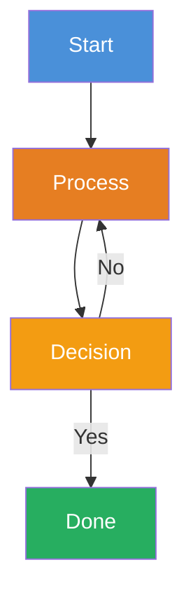

# Mermaid Diagram Pattern — Syntax, Accessibility & Error Prevention

Shared reference for ai-research and yt-research skills. Both skills produce Obsidian pages with mermaid diagrams. This file defines the rules for writing diagrams that render correctly and meet accessibility standards.

---

## ⛔ When Is a Sequence Diagram Required?

A `sequenceDiagram` is **conditionally mandatory** — only when the content involves actors with message flows.

### Decision Rule

Ask: **Does this topic involve who-talks-to-whom?**

| Yes → Sequence Diagram REQUIRED | No → Single Diagram SUFFICES |
|---|---|
| Systems communicating (API calls, service-to-service) | Purely conceptual or statistical content |
| Agents interacting (user → tool → AI → output) | Historical timelines without actor messaging |
| Process flows between distinct participants | Comparison tables, feature lists |
| Request/response patterns | Taxonomy or hierarchy (use mindmap instead) |

**If no actors exist, do NOT force a sequence diagram.** A mindmap or flowchart alone is sufficient.

### Mandatory Diagram Minimum

Every research page MUST include at least:
1. **One mindmap** (for conceptual frameworks or topic hierarchies) — MANDATORY
2. **One sequence diagram** — ONLY IF actors with message flows exist in the content
3. **Additional diagrams** (flowchart, timeline) — optional, based on content

---

## Syntax Rules — Avoiding Parse Errors

### Sequence Diagram Rules

| Rule | ❌ Breaks | ✅ Correct |
|---|---|---|
| No `style` directives | `style A fill:#4a90d9` inside sequenceDiagram → **PARSE ERROR** | Omit all styling from sequence diagrams. Mermaid does not support `style` in sequence context. |
| No `#` in message text | `A->>B: Skill #1 activates` → **PARSE ERROR** (treated as comment) | `A->>B: Skill 1 activates` |
| No raw `>` in messages | `A->>B: Source > Filters > Output` → **PARSE ERROR** (parsed as arrow) | `A->>B: Source to Filters to Output` |
| No `/` in messages (sometimes) | `A->>B: saved to docs/` → may break in some renderers | `A->>B: saved to docs folder` |
| No parentheses in messages (sometimes) | `A->>B: Verdict (Ship it)` → may break | `A->>B: Verdict — Ship it or Fix` |
| Commas in `Note over` are delimiters | `Note over A,B: Phase 1` → correct (comma separates participants) | Fine — this is valid syntax |
| Colons inside message text | `A->>B: Time: 12:00` → **PARSE ERROR** (colon ends the message) | `A->>B: Time is 12h00` |
| Apostrophes in messages | `A->>B: What's the question?` → may break | `A->>B: What is the question?` |

### Flowchart Rules

| Rule | ❌ Breaks | ✅ Correct |
|---|---|---|
| `#` inside node labels | `A["Skill #1"]` → may break | `A["Skill 1"]` |
| `&` multi-target syntax | `D2 & D3 & D4 --> E` → breaks in some renderers | Separate arrow per node: `D2 --> E` then `D3 --> E` etc. |
| `style` IS valid in flowcharts | `style A fill:#4a90d9,color:#fff` → **works correctly** | Use freely in flowchart blocks. |
| `<br/>` for line breaks in nodes | `A["Line 1\nLine 2"]` → may not render | `A["Line 1<br/>Line 2"]` |
| Curlyly braces for decision nodes | `E{"Verdict?"}` → correct | Fine — this is valid syntax |
| Pipe in labels | `A["a|b"]` → may break (pipe is graph syntax) | `A["a or b"]` |

### Mindmap Rules

| Rule | ❌ Breaks | ✅ Correct |
|---|---|---|
| No special chars in node text | `→`, `-`, `:`, `&`, `"` → **PARSE ERROR** | Use commas, spaces, `and` |
| No parentheses in nodes | `root((Topic (2026)))` → may break | `root((Topic 2026))` |
| No colons in nodes | `Key: Finding` → **PARSE ERROR** | `Key Finding` or `Key, Finding` |
| No ampersands | `R&D` → breaks | `R and D` |

### General Mermaid Rules (All Diagram Types)

| Rule | Why |
|---|---|
| Always close code fences with ` ``` ` on its own line | Unclosed fences break the entire page |
| Use `autonumber` as first line in sequence diagrams | Adds step numbers for accessibility and reference |
| Keep participant aliases short (2-3 chars) | `participant SK as Stakeholder` not `participant StakeholderWithLongName as Stakeholder` |
| Test in Obsidian before declaring pipeline complete | Mermaid version differences across Obsidian/validate |

---

## Accessibility — Color Contrast (WCAG AA)

### Approved Color Palette

All colors meet WCAG AA contrast ratio (≥ 4.5:1) with white text (`color:#fff`):

| Color | Hex | Use Case | Contrast vs White |
|---|---|---|---|
| Blue | `#4a90d9` | Entry/starting nodes, first phase | 4.57:1 ✅ |
| Orange | `#e67e22` | Process/skill activation | 4.80:1 ✅ |
| Green | `#27ae60` | Positive/feasible outcomes | 4.51:1 ✅ |
| Light Green | `#2ecc71` | Success confirmation | 3.27:1 ⚠️ (use only for large nodes) |
| Red | `#e74c3c` | Warnings, blocks, hard walls | 5.02:1 ✅ |
| Purple | `#9b59b6` | Analysis/output phases | 4.04:1 ⚠️ (borderline — use sparingly) |
| Dark Blue | `#2c3e50` | Terminal/done nodes | 13.84:1 ✅ |
| Amber | `#f39c12` | Conditional/warning outcomes | 4.07:1 ⚠️ (borderline) |
| Gray | `#95a5a6` | Passive participants (codebase, files) | 2.63:1 ❌ (use `#7f8c8d` instead, 4.31:1) |

### Where Colors Apply

- **Flowcharts:** Use `style` directives freely. Always pair `fill` with `color:#fff`.
- **Sequence diagrams:** CANNOT use `style`. Colors are NOT applicable — rely on clear participant naming and `autonumber` instead.
- **Mindmaps:** CANNOT use `style`. Use node text clarity for differentiation.

### Approved Pattern (Flowchart Only)



### Anti-Patterns

- ❌ `style A fill:#ffe066,color:#333` — yellow with dark text looks fine but fails in dark mode Obsidian
- ❌ `style A fill:#e74c3c` — red fill without specifying `color:#fff` defaults to dark text on red (fails contrast)
- ❌ Using colors inside sequence diagrams — Mermaid does not support this and will error
- ❌ Using more than 5-6 distinct colors — creates cognitive overload, not accessibility

---

## Pre-Save Mermaid Checklist

Before saving any Obsidian page, verify each diagram:

```
📋 Mermaid Checklist

   [ ]  1. Code fence: opens with ```mermaid AND closes with ``` on separate line
   [ ]  2. No `style` directives in sequenceDiagram blocks
   [ ]  3. No `#` characters inside any mermaid block (use spaces or numbers)
   [ ]  4. No raw `>` in message text (use "to" or "→" spelled out)
   [ ]  5. No colons inside sequence message text after the label colon
   [ ]  6. No `&` multi-target in flowchart arrows (use separate arrows)
   [ ]  7. No special chars in mindmap nodes (→, -, :, &, ", parens)
   [ ]  8. All flowchart `style` directives include both `fill` AND `color:#fff`
   [ ]  9. Colors from approved palette only (WCAG AA compliant)
   [ ] 10. Sequence diagrams use `autonumber` as first line
   [ ] 11. At least 1 mindmap present (MANDATORY for all pages)
   [ ] 12. Sequence diagram ONLY if actors with message flows exist
   ━━━━━━━━━━━━━━━━━━━━━━━━━━━━━━━━━━━━━━━━━━━━━━
```

---

## Common Errors and Fixes

| Error Message | Likely Cause | Fix |
|---|---|---|
| `Parse error... Expecting 'NEWLINE'` | `style` inside sequenceDiagram | Remove all `style` lines from sequence blocks |
| `Parse error... got 'INVALID'` | Special char (`#`, `>`, `:`) in message text | Replace with plain text equivalent |
| Diagram shows as empty rectangle | Unclosed code fence | Ensure ` ``` ` on its own line closes the block |
| Node text disappears | `#` or `|` inside `["..."]` label | Remove `#`, replace `|` with `or` |
| Mindmap shows broken layout | Special chars in node text | Use only letters, numbers, commas, spaces |
| Flowchart arrows missing | `&` multi-target syntax | Use separate arrow lines for each target |
