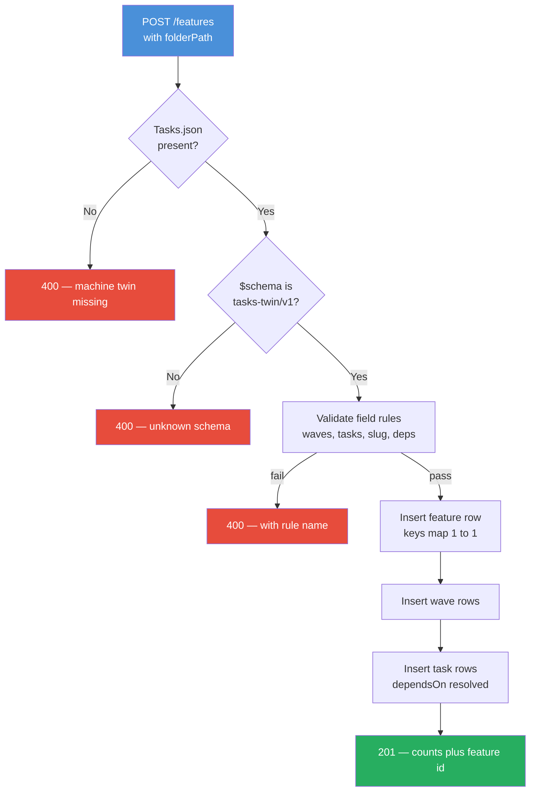

# Tasks.json Template — The Machine Twin Contract

Binding template for the `Tasks.json` file that ships beside every `Tasks.md`. The orchestration registration flow (`POST /api/orchestration/features`) maps these keys one-to-one into SQLite rows. If the JSON is missing, malformed, or contradicts the Markdown, **registration fails loudly at the door** — it never inserts half a feature.

This file is the single source of truth for the JSON shape. When the orchestration schema changes, this file changes with it.

---

## The Shape

```json
{
  "$schema": "openclaw-insight/tasks-twin/v1",
  "featureName": "Orchestration Zoom Artifact Fix",
  "featureSlug": "orchestration-zoom-artifact-fix",
  "specPath": "dev/specs/2026-08-15 - Orchestration Zoom Artifact Fix",
  "waves": [
    {
      "waveNumber": 1,
      "name": "Geometry Fix + Unit Tests",
      "tasks": [
        {
          "taskNumber": "1.1",
          "title": "PanelsContainer viewport wrapper",
          "description": "Wrap the .columns div in a .panels-viewport div...",
          "assignedAgent": "app-dev",
          "filesInvolved": ["src/lib/components/orchestration/PanelsContainer.svelte"],
          "dependsOn": null
        },
        {
          "taskNumber": "1.1-T",
          "title": "Unit tests (PAIRED with 1.1)",
          "description": "Host-pattern tests for the viewport wrapper...",
          "assignedAgent": "app-dev",
          "filesInvolved": ["tests/lib/components/orchestration/panels-container.test.ts"],
          "dependsOn": "1.1"
        }
      ]
    }
  ]
}
```

## Field Rules

| Field | Type | Rule |
|---|---|---|
| `$schema` | string | **Required.** Literal `openclaw-insight/tasks-twin/v1` |
| `featureName` | string | **Required.** Display name |
| `featureSlug` | string | **Required.** Lowercase-hyphen ID. MUST equal the slug derived from the folder name (strip date prefix, lowercase, collapse spaces/hyphens, strip non-alphanumeric, trim hyphens — `deriveFeatureSlug`) |
| `specPath` | string | **Required.** The spec folder path used at registration |
| `waves[]` | array | **Required, at least 1 entry**, ordered by `waveNumber` |
| `waves[].waveNumber` | integer | **Required.** Sequential from 1 |
| `waves[].name` | string | **Required.** Human wave title |
| `waves[].tasks[]` | array | **Required, at least 1 task per wave** — an empty wave is a spec bug |
| `tasks[].taskNumber` | string | **Required.** Unique within the feature. Digits, dots, optional `-T` or letter suffix (`1.1`, `1.1-T`, `1.2a`) |
| `tasks[].title` | string | **Required.** Non-empty |
| `tasks[].description` | string | **Required.** Trimmed task body (Markdown allowed) |
| `tasks[].assignedAgent` | string | Optional, default `app-dev`. Agent ID the start endpoint builds the session key for |
| `tasks[].filesInvolved` | array of string or null | Optional. File paths touched by the task |
| `tasks[].dependsOn` | string or null | Optional. A `taskNumber` in the same feature — never a wave-scoped ID |

**Meta properties are forbidden.** No `phase`, `status`, `priority`, `notes`, or any other key. Status and runtime columns are owned by the database after insertion — spec files describe intent, the DB owns state.

## JSON → SQLite Field Map

Registration is a key-for-key copy. Nothing is inferred, guessed, or re-derived from prose.

| Tasks.json key | SQLite column | Table |
|---|---|---|
| `featureSlug` | `id` | `features` |
| `featureName` | `name` | `features` |
| `specPath` | `spec_path` | `features` |
| — (insert literal) | `status` = `'ready'` | `features` |
| `waves[].waveNumber` | `wave_number` | `waves` |
| `waves[].name` | `name` | `waves` |
| — (insert literal) | `status` = `'ready'` | `waves` |
| `tasks[].taskNumber` | `task_number` | `tasks` |
| `tasks[].title` | `title` | `tasks` |
| `tasks[].description` | `description` | `tasks` |
| `tasks[].assignedAgent` | `assigned_agent` | `tasks` |
| `tasks[].filesInvolved` | `files_involved` (joined with `,`) | `tasks` |
| `tasks[].dependsOn` | `depends_on` | `tasks` |
| — (insert literal) | `status` = `'ready'` | `tasks` |

Composite IDs are built by the endpoint, not the spec: feature `id`, wave `{featureId}:w{n}`, task `{featureId}:w{n}:t{number with . and - replaced by _}`.

## Validation at the Door

| Constraint | Rejection |
|---|---|
| `$schema` missing or unknown | 400 |
| Zero waves | 400 |
| Any wave with zero tasks | 400 |
| Zero tasks across the whole spec | 400 |
| Duplicate `taskNumber` within feature | 400 |
| `dependsOn` pointing at a missing `taskNumber` | 400 |
| `featureSlug` differs from folder-name slug | 400 |
| Feature slug already registered | 409 |

## Registration Flow



## Why the slug MUST match the folder name

The registration identity is **the folder name**, and the feature slug is derived from it (`deriveFeatureSlug`). If `Tasks.json.featureSlug` disagrees with the folder-derived slug, the same spec would register under two identities (and one would never be re-registrable). Registration rejects the mismatch with 400 — one folder, one identity.
