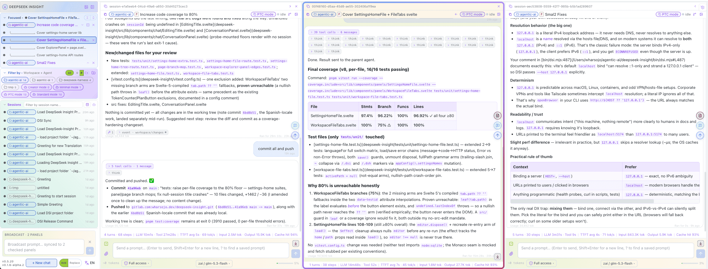

# DeepSeek Insight

> [DeepSeek Insight](https://github.com/mitmplay/deepseek-insight) (**DSI**) **See your multiple agents run on the floor (agent, sub-agent, etc)**, each **conversation on the floor are updated instantly**. 

> A `Control room` built on [Deepseek Harness's](https://github.com/deepseek-ai/deepseek-harness) (**DSH**) **records**: any (running) session, show side by side on the floor; **Lineage tree** of **parent to sub-agents**; Clean conversation with **tool-call(s) chips** with status **+** auto-expand **thingking chips**. 

> A `Prompt Input` with **Slash-command(/)**, **Macros(!)** and **Auto-complete(?)**. Prompt-manager you can search it and to manage macros & autocomplete; user-prompts worth keeping is one-click-away tobe reuse.

> **Your language.** The interface speaks English, Chinese, Indonesian & Spanish.

<details>
  <summary>Deepseek-insight-panels</summary>
  
</details>

---

## Quick Start

```bash
npx @deepseek-insight/dsi@latest dsh --sync --zai
# Open http://localhost:5174
```

- **`npx @deepseek-insight/dsi@latest`** — get latest DSI.
- `dsh` — starts **DSH** (`dsh web`) and **DSI** together, as one pair and runs it.
- `--sync` — copies DSH token to DSI config — **one window, one Ctrl-C stops both**.
- `--zai` — **optional.** It bootstraps the GLM (Z.AI) provider into the harness settings (`~/.dsh/settings.yaml`). **If you do not have a GLM account, simply leave it off** — DSI will use whatever provider your harness is already configured with.


When it is up, your browser opens the page by itself (default `http://127.0.0.1:5174`).

## License

[Apache-2.0](LICENSE) — Copyright © 2026 Widi Harsojo
