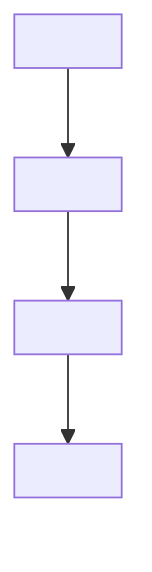

# RCA Template — The Skeleton (copy verbatim, delete the guidance, keep the headings)

The bracketed guidance in each section explains the depth that section owes.
Guidance is scaffolding: it ships in the skill, never in the finished RCA.

The exemplar that shows this template fully lived:
`dev/kb/rca/2026-10-06 - RCA — The Renderer That Told the Truth Badly
(Dull Diagrams, Single-Line Tables, Captures From the Top).md`.

---

````markdown
# RCA — <The Name: a memorable claim about the defect, not its title>

> RCA note, YYYY-MM-DD. <Two or three sentences in plain language: what
> broke, for whom, and the shape of the cause. If multiple defects, say how
> many and promise the shared root. Cite the fix commits by sha.>

## The complaints, in the operator's own words
<Numbered verbatim quotes of each defect report (user words, test names, or
error text). These are the entrance of the story — never paraphrase them
into jargon here.>

## Words used below (layman glossary)
| Word | Meaning in this note |
|---|---|
| **<term>** | <One plain sentence. Every jargon word the body uses lands here first.> |

## The shared root, in one paragraph
<For multi-defect RCAs: the single underlying cause the individual bugs
share — a stale default, an inherited property, a missing contract. For a
single-defect RCA, this section merges into the first bug's story.>

## Bug 1 — <A name that states the defect as a claim>
### The failure chain

### The fix, and the trap inside it
<Narrative: what changed, then the secondary defect the fix itself nearly
introduced (there almost always is one — the inheritance chain, the false
positive, the escaped emergency net). Say how the trap was caught
(simulation, test, preview) and why that catcher works.>

<Repeat Bug N for each defect.>

## <A mermaid sequenceDiagram whenever actors hand state to each other>
<operator → component → runtime → clone; label each arrow with the actual
call or mutation. See references/mermaid-rules.md for syntax gates.>

## What does NOT change
<Explicit blast-radius bounds: the older protections still standing, the
modes untouched, the inputs that behave exactly as before.>

## What to carry forward
<Numbered portable lessons, each phrased as a rule with its earning trap
attached. "Be careful" is not a lesson; "a clone is a photograph of a fresh
document" is.>
````

---

## Section-by-section depth guide

- **The Name** — a claim someone remembers in six months ("The Photograph
  That Reframed Itself"), never the component's name alone ("CanvasCopyButton
  RCA").
- **The complaints** — the operator's words are the entrance of the story.
  Paraphrasing them into jargon here defeats the whole narrative contract.
- **The glossary** — every jargon word the body will use, one plain sentence
  each, BEFORE the body. A newcomer reads top-to-bottom without opening the
  codebase.
- **The shared root** — one paragraph. If you cannot write it, you have a
  changelog, not an RCA: either find the cause the bugs share or split the
  note.
- **Failure chains** — the chain shows how a *reasonable* choice at time T
  became a defect at time T+1. If your chain's first box is already a
  mistake, you are narrating blame, not cause.
- **The trap inside the fix** — there almost always is one (an inheritance
  chain, a false positive, an escaped emergency net). An RCA that reports a
  clean one-step fix is usually hiding it. Say how the trap was caught
  (simulation, test, preview) and why that catcher works.
- **What to carry forward** — rules with their earning trap attached.
  "Be careful" is not a lesson; "a clone is a photograph of a fresh
  document" is.
